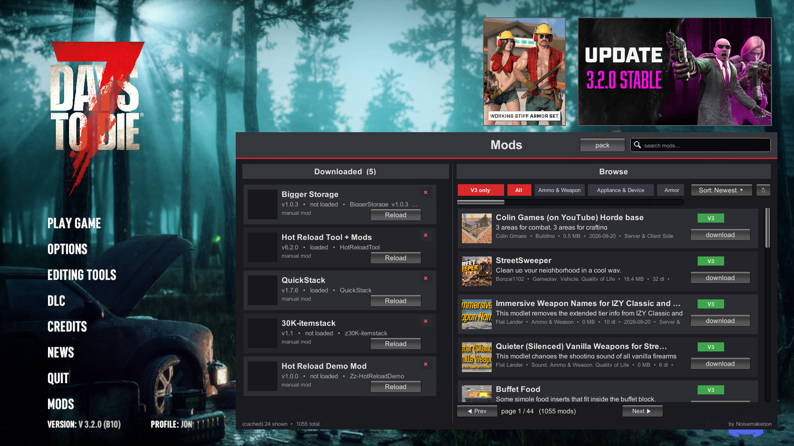

# Jon's Mod Browser + Hot Reload

A **MODS** button for 7 Days to Die (V1.0+ / V3.x). Browse, search, and install **3,800+ mods from [7daystodiemods.com](https://www.7daystodiemods.com)** without ever leaving the game — version-matched to your game, with real card pictures, and every install **hot-loads instantly: no restart, ever**.



## Why

The normal loop is alt-tab → website → check versions → download zip → extract into Mods → relaunch the game → repeat. This mod replaces that whole loop with one button in the main menu:

- **Browse** the whole catalog in-game (split view: Downloaded | Browse), floating over the game — no dimming, no blur
- **Live search** (auto-runs as you type), category chips, sorting, paging
- **One-click install / update / remove** — mods hot-load in seconds
- **Pack codes** — share your whole modlist as one short `HRP1-…` string; friends paste it and everything installs itself
- **Server pack push** — server owners run `hr pack apply <code>` once; every player who joins gets a one-click "Install pack" prompt
- **Hot reload engine** for mod authors: edit any mod's XML/XUI/localization/C# while playing and it re-applies in seconds. The tool even hot-swaps *itself*.

## Install (2 minutes)

1. Grab the zip from [Releases](../../releases).
2. Unzip, then drop the `HotReloadTool` folder into your Mods folder — either:
   - `%AppData%\7DaysToDie\Mods` (easiest — paste that into Explorer's address bar), or
   - `<game folder>\Mods`
   
   Final path must look like `...\Mods\HotReloadTool\ModInfo.xml`
3. Launch the game → click **MODS**. Done.

No other dependencies. Nothing outside the Mods folder is touched; delete the folder to uninstall.

## Console (F1)

```
hr status              what the tool is doing
hr doctor              full engine-API self-check
hr browser open        open the Mods window
hr pack make <name>    build a pack code from your browser-installed mods
hr pack apply <code>   install a pack (server owners: use this one)
hr pack list           saved packs
hr watch               live-reload on file save (mod authors)
```

## For mod authors

Drop your mod anywhere under `%AppData%\7DaysToDie\Mods`, keep editable sources in `YourMod\src\*.cs`, and enable the watcher (`hr watch`). Save a file → it recompiles/patches and hot-swaps in ~4 seconds, including prebuilt DLL mods. `hr doctor` verifies the environment.

## How it works (short version)

The bootstrap DLL stays stable and intercepts the game's mod-DLL loader; everything else lives in a core DLL that byte-loads and hot-swaps at runtime. The Mods window is an IMGUI overlay driven by a Harmony postfix on the window manager's OnGUI, with the catalog served by the public `api.7daystodiemods.com/v1` API (thumbnails cached on disk, prefetched as you scroll, hard data cap per session).

## License

MIT — do whatever, attribution appreciated. Not affiliated with The Fun Pimps or 7daystodiemods.com.

— *by Noisemakerjon*